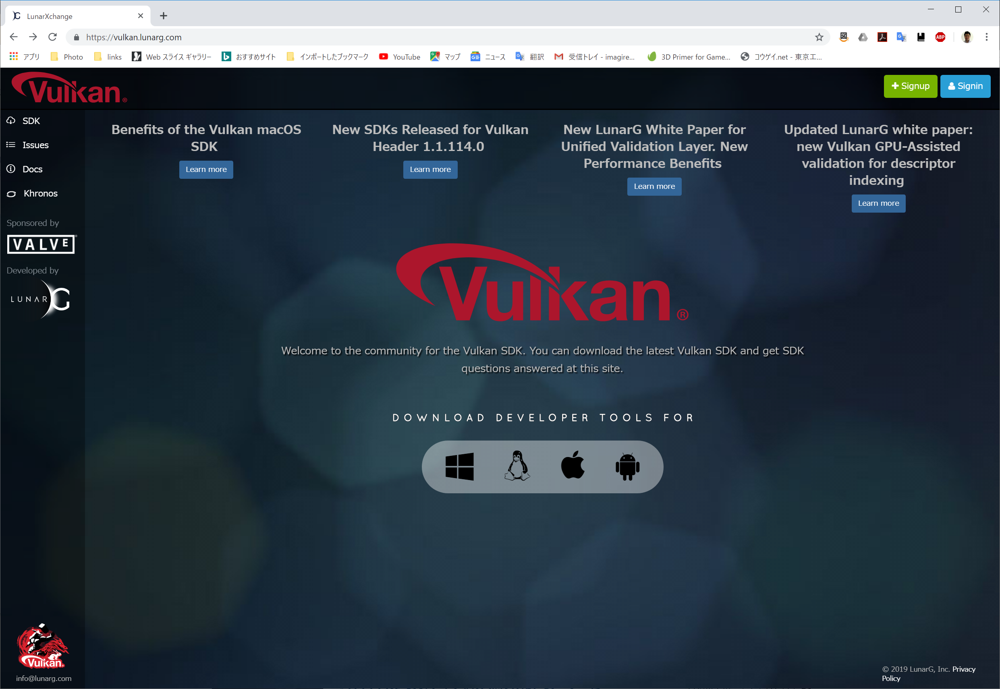
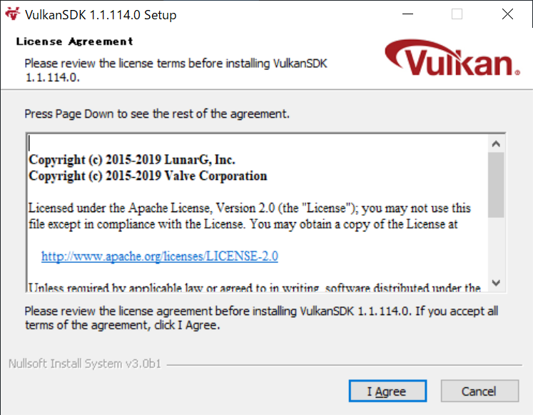
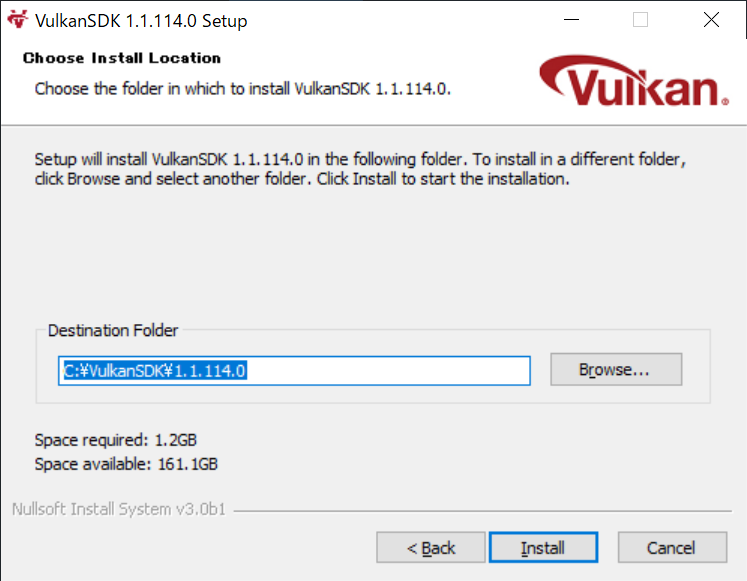
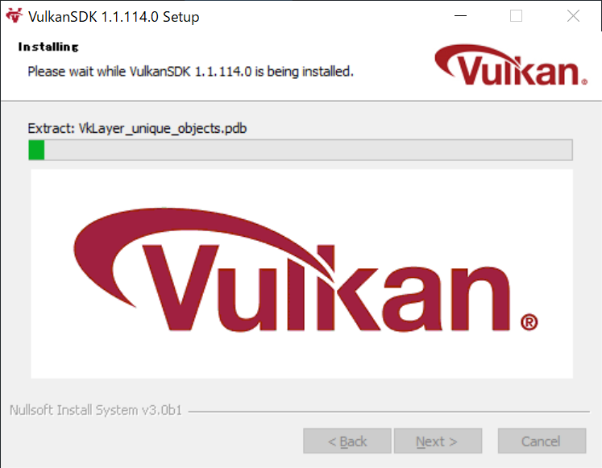
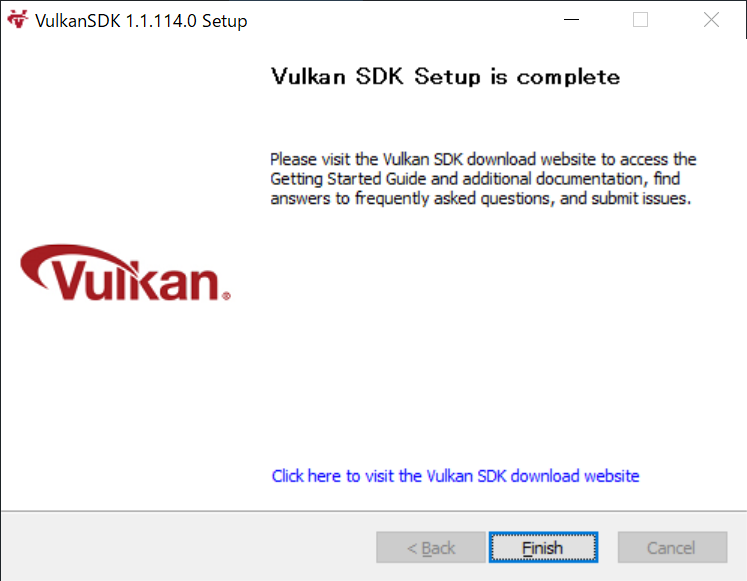
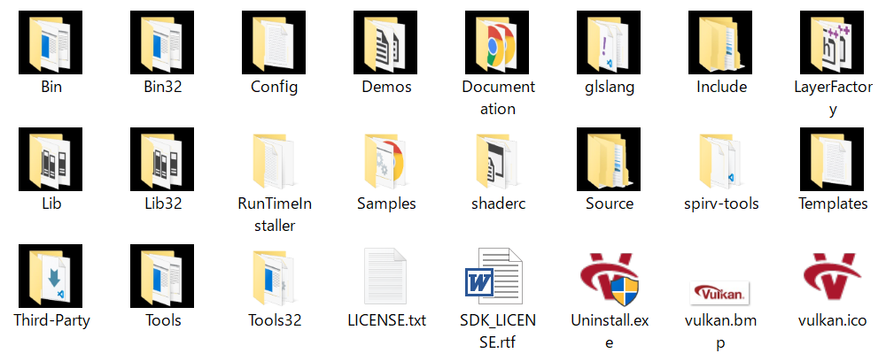

# 環境設定

環境設定はプログラミングするうえで面倒くさいことの一つです。
といっても逃げられらないので、少しづつ進めていきましょう。

環境として、フレームワークにGLFW、行列処理にGLMを使う例が多いようなので、そちらに沿って行きたいと思います。

# VisualStudio

開発する統合環境として、Visual Studio を使います。

今回は、Microsoft Vidual Studio Community 2019 を使って進めます。
執筆時点では、Vulkan SDK は、Vidual Studio 2015以降での対応のようですが、
ゲームの開発は長くなりがちなので、なるべく最新のVisual Studioで勉強するのがよいでしょう。
(SDK、ツールが更新して、動かなくなったプログラムを修正で苦労するのは、プログラミングでよくあることです。よくはないのですが…)。

Visual Studio のインストールは、[Visual Studio のホームページ](https://visualstudio.microsoft.com/ja/)からインストールする製品を選択してインストールします。

インストール時に、「C++によるデスクトップ開発」を選択してください。

# Vulkan SDK

Vulkan を使うために必要なSDKは、Vulkan SDK です。
実際には、LunarG Vulkan SDKというSDKぐらいしか選択肢がないようです。

LunarG Vulkan SDK をダウンロードするには、[LunarGのサイト](https://vulkan.lunarg.com/)に行って、SDKをダウンロードしてきます。

インストールはありがちなウィザードの進行で進んでいきます。
実質的に入力するのは、インストール先だけでしょうか。標準では、「c:\VulkanSDK\バージョン番号\」にインストールされますが、他の場所にインストールすることもできます。

インストールした後のフォルダ構成は、下図のようになっています。
特に大事なフォルダは、次のようなものでしょうか。

* include: ヘッダファイルが入っています
* Lib: ライブラリファイルが収められています。(32ビット版向けには、Lib32)

Vulkan SDK が使えるかどうかの判定は、サンプルプログラムを実行することで確認できます。
「Bin/vkcube.exe」を実行してみてください。

実行できない場合は、グラフィックスカードのドライバーをVulkan対応の最新のものにしてみてください。
あまりにPCが古い場合は、新しいPCを購入しましょう。現在は、安いPCでもVulkanプログラムは実行できます。

* [戻る](./)
