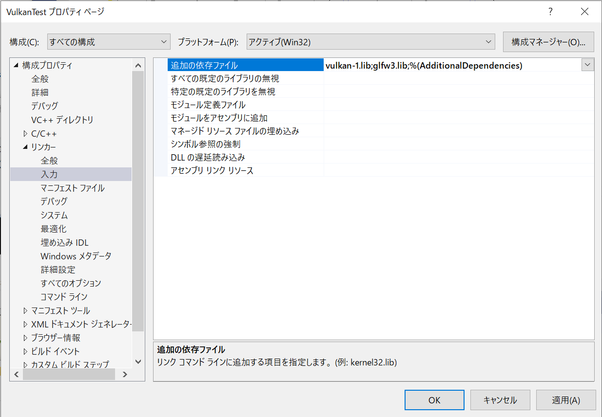
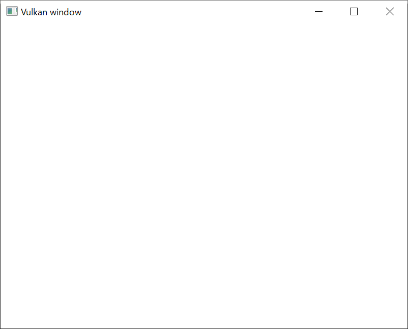

# はじめてのVulkan

Vulkanを使ったプログラムを一からビルドしていきましょう。

[今回のコード](https://github.com/vulkanstudy/3_helloworld)はこちら。

# VisualStudio

Visual Studio を立ち上げましょう。今回は、「新しいプロジェクトの作成」からプロジェクトを作っていきます。

「新しいプロジェクトの作成」では、C++の「Windows デスクトップ ウィザード」を選択してください。

Windowsデスクトップウィザードでは、プロジェクトの名前や保存する場所を指定します。
今回のプロジェクト名は、「VulkanTest」にしてみます。
私のアカウント名は、「imagire」なので、ユーザーフォルダ以下の「imagire」の下にファイルを保存していますが、皆さんのユーザーの好きな場所に保存してください。

さて、次はプロジェクトのテンプレートの設定です。

今回は、コンソールアプリケーションとして作成してみます。

それ以外は、「空のプロジェクト」として、シンプルに構成してみましょう。

出来上がると、エディタの画面が立ち上がります。

このままでは、ファイルが何もないので、プログラムが実行できません。
ファイルを追加していきましょう。

ファイルの追加方法はいくつかありますが、例えば、「ソリューションエクスプローラー」の「ソースファイル」を選択してから右クリックして、
「追加」、「新しい項目」と、順次選択していきます。

「新しい項目の追加」ウィンドウでは、ファイルの種類を選べるので、ここでは「C++ファイル(cpp)」を選択します。
ファイル名は、「main.cpp」などとしておきましょうか。

新しく追加したコースコードに、プログラムの開始点となるメイン関数を追加します。

ひとまず、何も考えずに、下図のコードを入力してください。
こちらは、Vulkanチュートリアルで、開発環境のテストのために入力しているプログラム([https://vulkan-tutorial.com/Development_environment](https://vulkan-tutorial.com/Development_environment))となります。

さて、ソースコードが追加されたので、デバッグ実行したくなります。

が、ライブラリの設定をしていないので、プログラムはビルドができません。
それ以前にライブラリのパスが通っていないので、コンパイルの時点でエラーとなります。

きちんと通るようにするには、下記の設定が定番です(GLMのようにヘッダだけの場合は、インクルードが追加すればOK)。

* インクルードファイルのパスを通す
* ライブラリのパスを通す
* 使用するライブラリを追加する。

慣れれば苦ではないですが、いきなりすらすらできるものでもないかもしれないので、ひとつづつ設定していきましょう。

まずは、開発のターゲットを「x86」から「x64」に切り替えておきましょう。

さて、インクルードディレクトリの追加です。

メニューの「プロジェクト」の「プロパティ」の設定から、各種ファイルの設定を行っていきます。

なお、開いたプロパティのウィンドウでは、左上の「構成」の項目が「すべての構成」になっていることを確かめてください。
こちら、デバック版とリリース版の設定の切り替えになりますが、今回は、ともに同じ設定を用いるので、一回にまとめて設定をします
（異なる設定の際は、こちらのタブを切り替えて、それぞれの設定を行ってください）。

「構成プロパティ」の「C/C++」の「全般」にある「追加のインクルードディレクトリ」から、プルダウンでメニューを選択して、「編集」に入ってください。

追加するインクルードディレクトリは、Vulkan SDK のインクルードディレクトリと、GLFW, GLM のインクロードディレクトリになります。
Vulkan SDK のインクルードファイルは、ディフォルトのインストール設定では「C:\VulkanSDK\バージョン\include」の中にあるので、このディレクトリを追加します。
GLFW, GLMについては、「C:\OpenGL\include」の下に、それぞれのライブラリが入ったフォルダをコピーしましたので、その上位のディレクトリを追加します。

次は、ライブラリの追加です。
まずは、ディレクトリを追加します。

今度は、「リンカー」の「全般」にある「追加のライブラリディレクトリ」を編集してください。

追加するフォルダは、「C:\VulkanSDK\バージョン\Lib」と、GLFWのライブラリが置かれた「C:\OpenGL\lib」になります。

次に、ライブラリファイルの指定です。
ライブラリファイルを確認してみましょう。
「C:\VulkanSDK\バージョン\Lib」に入ると、いくつかのファイルがあります。この中の「vulkan-1.lib」が目的のファイルです。

「リンカー」の「入力」にある「追加の依存ファイル」を編集してください。

こちらに、今回のライブラリである、「vulkan-1.lib」とGLFWのライブラリである「glfw3.lib」を追加します。

追加結果は次のようになっているかと思います。

あと、Vulkanチュートリアルでは、C++のバーションも指定していました。
「ISO C++ 17 標準」指定されていて、特に問題がないのであれば、こちらを指定してよいでしょう。

ついに実行です！

といっても、今回は、白い画面が表示されるだけとなります。

ここから、どんどんと表示をしていきましょう。

* [戻る](./)
