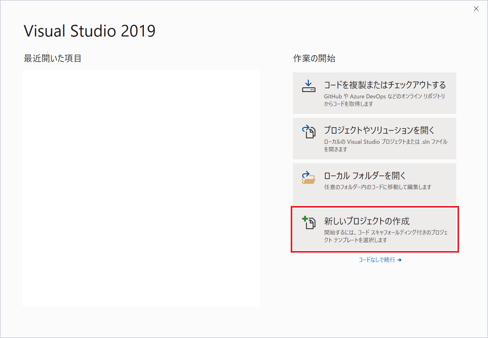
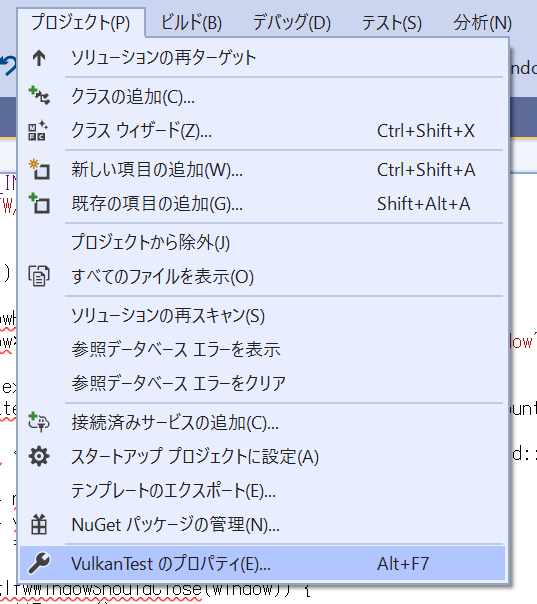
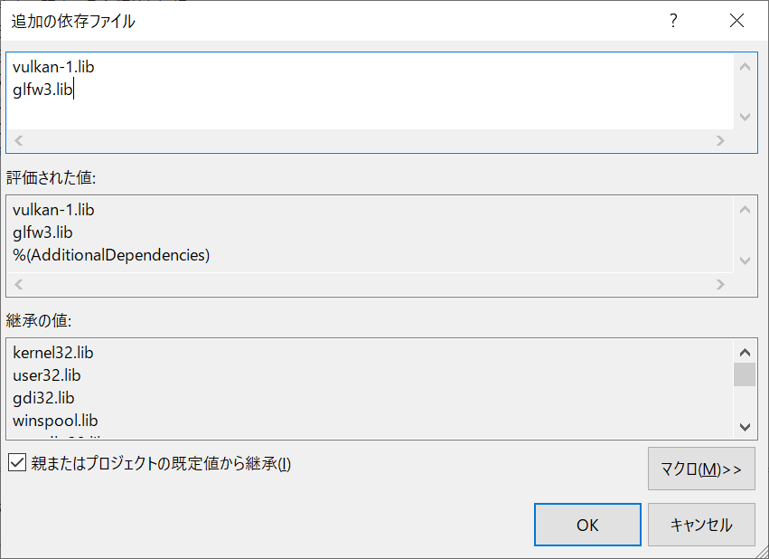

# はじめてのVulkan

Vulkanを使ったプログラムを一からビルドしていきましょう。

# VisualStudio

Visual Studio を立ち上げましょう。今回は、「新しいプロジェクトの作成」からプロジェクトを作っていきます。

「新しいプロジェクトの作成」では、C++の「Windows デスクトップ ウィザード」を選択してください。

Windowsデスクトップウィザードでは、プロジェクトの名前や保存する場所を指定します。
今回のプロジェクト名は、「VulkanTest」にしてみます。
私のアカウント名は、「imagire」なので、ユーザーフォルダ以下の「imagire」の下にファイルを保存していますが、皆さんのユーザーの好きな場所に保存してください。

* [戻る](./)
