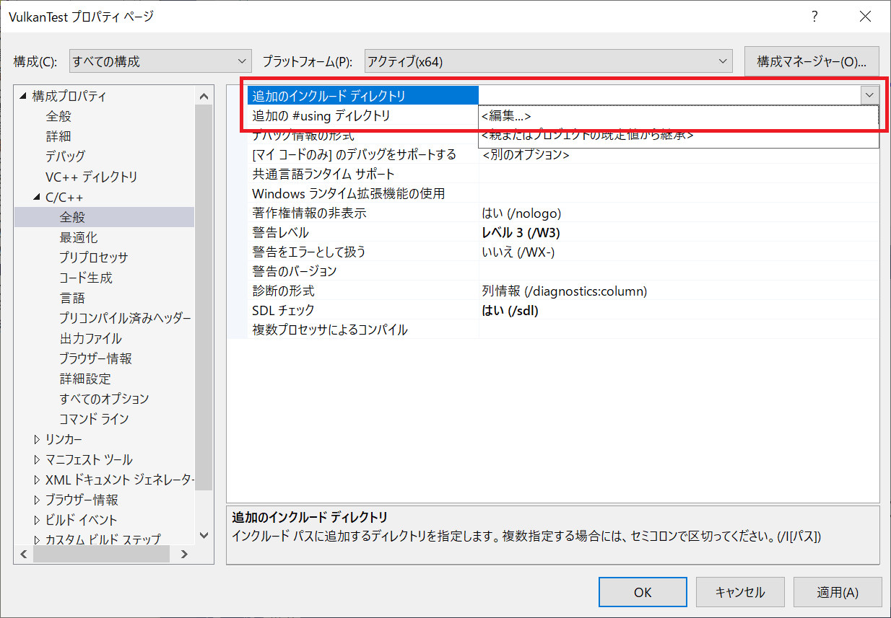
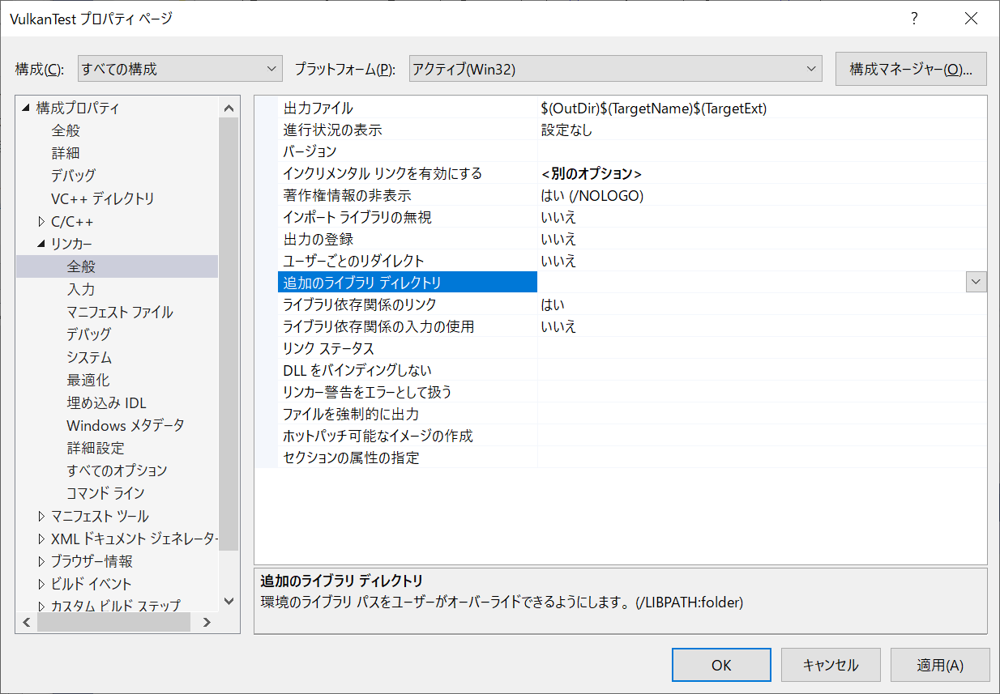

# はじめてのVulkan

Vulkanを使ったプログラムを一からビルドしていきましょう。

# VisualStudio

Visual Studio を立ち上げましょう。今回は、「新しいプロジェクトの作成」からプロジェクトを作っていきます。

「新しいプロジェクトの作成」では、C++の「Windows デスクトップ ウィザード」を選択してください。

Windowsデスクトップウィザードでは、プロジェクトの名前や保存する場所を指定します。
今回のプロジェクト名は、「VulkanTest」にしてみます。
私のアカウント名は、「imagire」なので、ユーザーフォルダ以下の「imagire」の下にファイルを保存していますが、皆さんのユーザーの好きな場所に保存してください。

さて、次はプロジェクトのテンプレートの設定です。

今回は、コンソールアプリケーションとして作成してみます。

それ以外は、「空のプロジェクト」として、シンプルに構成してみましょう。

出来上がると、エディタの画面が立ち上がります。

このままでは、ファイルが何もないので、プログラムが実行できません。
ファイルを追加していきましょう。

ファイルの追加方法はいくつかありますが、例えば、「ソリューションエクスプローラー」の「ソースファイル」を選択してから右クリックして、
「追加」、「新しい項目」と、順次選択していきます。

「新しい項目の追加」ウィンドウでは、ファイルの種類を選べるので、ここでは「C++ファイル(cpp)」を選択します。
ファイル名は、「main.cpp」などとしておきましょうか。

新しく追加したコースコードに、プログラムの開始点となるメイン関数を追加します。

ひとまず、何も考えずに、下図のコードを入力してください。
こちらは、Vulkanチュートリアルで、開発環境のテストのために入力しているプログラム([https://vulkan-tutorial.com/Development_environment](https://vulkan-tutorial.com/Development_environment))となります。

* [戻る](./)
