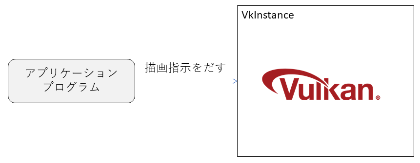
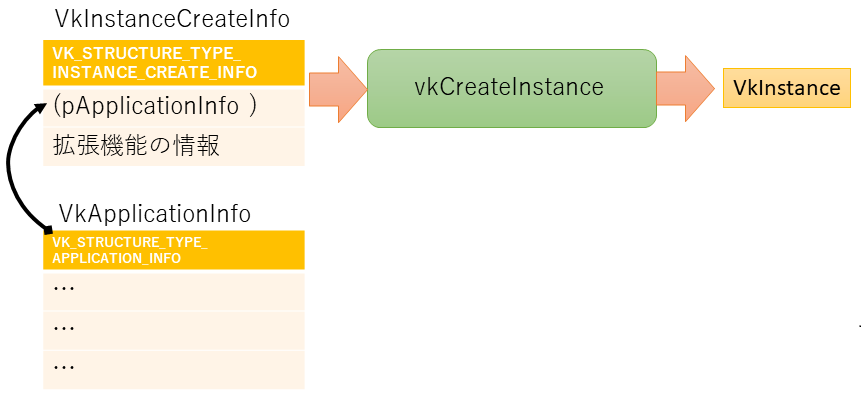
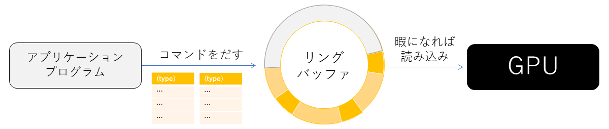
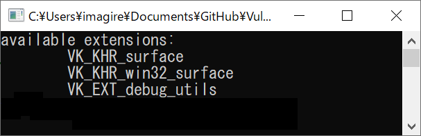
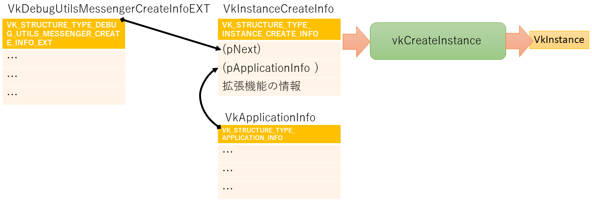

# 初期化

少しづつVulkanのプログラムを作っていきましょう

今回のプログラムを入力して、[最終的に作られるコード](https://github.com/vulkanstudy/4_setup)はこちら。

# アプリケーションクラスの導入

メイン関数をシンプルにするために、アプリケーションクラスを導入していきましょう。

## メイン関数

アプリケーションクラスを導入することで、メイン関数はシンプルにできます。
具体的には、アプリケーションクラスのインスタンスを作成して、`run()` メソッドを呼び出します。

```cpp:src/main.cpp
#include <iostream>
#include "MyApplication.h"

int main() 
{
	MyApplication app;

	try {
		app.run();
	}
	catch (const std::exception& e) {
		std::cerr << e.what() << std::endl;
		return EXIT_FAILURE;
	}

	return EXIT_SUCCESS;

	return 0;
}
```

## アプリケーションクラス

アプリケーションクラスは、次のクラスを拡張していくものとなります。

```cpp:src/MyApplication.h 
#pragma once

class MyApplication
{
public:
	MyApplication();
	~MyApplication();

	void run();
};
```

# ウィンドウの生成
Windows のアプリケーションは、画面の一部分の「窓」で実行されます（全画面かもしれませんが）。

GLFWは、OSのAPI呼び出しを大分サポートしてくれるので、かなり簡単にウィンドウを生成することができます。
この処理だけを追加してみましょう。

## 宣言の追加

GLFWでは、GLFWwindowへのポインタとして、ウィンドウを管理することができます。
こちらは、アプリケーションクラスのメンバーとして持たせましょう。
後は、セッティングとしての「初期化」、「後片付け」のメソッドと、初期化が終わった後の基本ループである「通常処理」の呼び出しでアプリケーションを実行させ続けることができます。


```cpp:src/MyApplication.h 
#pragma once

#include <GLFW/glfw3.h>

class MyApplication
{
private:
	GLFWwindow* window_;
public:
	MyApplication(): window_(nullptr){}
	~MyApplication() {}

	void run()
	{
		// 初期化
		initializeWindow();

		// 通常処理
		mainloop();

		// 後片付け
		finalizeWindow();
	}
};
```

## 生成処理の実体

では、それぞれのメソッドの中を見てみましょう。

GLFWは、``glfwInit()``関数で初期化して、``glfwCreateWindow()``関数でウィンドウを生成します。
glfwCreateWindowの返り値が、GLFWwindowのインスタンスへのポインタです。
引数は、ウィンドウ内の解像度とタイトル名などを指定します。``nullptr``になっているパラメータは、
後から登場するので、気にしないで進んでいきましょう。

ウィンドウ生成時のオプションは、``glfwWindowHint``で指定します。
今回は、Vulaknを使うので、OpenGL やOpenGL ES でない ``GLFW_NO_API``の指定と、
ユーザーによるウィンドウのサイズ変更を禁止する設定を行いました。
他のオプションは、GLFWの「Window guide」の[「Window creation hints」](https://www.glfw.org/docs/latest/window_guide.html#GLFW_CLIENT_API_hint)の項目を見てみてください。

```cpp:src/MyApplication.h 
	constexpr static char APP_NAME[] = "Vulkan Application";
	// 表示ウィンドウの設定
	void initializeWindow()
	{
		const int WIDTH = 800;
		const int HEIGHT = 600;

		glfwInit();

		glfwWindowHint(GLFW_CLIENT_API, GLFW_NO_API);// OpenGL の種類の設定
		glfwWindowHint(GLFW_RESIZABLE, GLFW_FALSE);// ユーザーはウィンドウサイズを変更できない

		window_ = glfwCreateWindow(WIDTH, HEIGHT, APP_NAME, nullptr, nullptr);
	}
```

後片付けは、初期化のそれぞれに対応する関数`glfwTerminate()`、`glfwDestroyWindow()`を、逆順で呼び出していきます。


```cpp:src/MyApplication.h 
	void finalizeWindow()
	{
		glfwDestroyWindow(window_);
		glfwTerminate();
	}
```

メインループは、GLFWが終わらないか確認しながら、イベントが起きる様なら(例えば、キーボード入力)それを処理していきます。

```cpp:src/MyApplication.h 
	// 通常の処理
	void mainloop()
	{
		while (!glfwWindowShouldClose(window_))
		{
			glfwPollEvents();
		}
	}
```

# Vulkanの導入

GLFWの頑張りで、ウィンドウを表示することができたので、次は、Vulkanが画面を表示するようにしていきます
（といっても、実際に意味のある画面を表示するのは、まだまだ先なのですが…）。

Vulkanに指示を出すのは、「VkInstance」のインスタンス(Vulkanのメモリ的な意味での実体)を通して行います。


## 宣言の追加

Vulkanの初期化と後片付けのコードをまず追加してきましょう。

```cpp:src/MyApplication.h 
#define GLFW_INCLUDE_VULKAN // ★追加！GLFWの読み込み前に、Vulkanを使うことを宣言
#include <GLFW/glfw3.h>

	VkInstance instance_;// ★追加！
	void run()
	{
		// 初期化
		initializeWindow();
		initializeVulkan();// ★追加！

		// 通常処理
		mainloop();

		// 後片付け
		finalizeVulkan();// ★追加！
		finalizeWindow();
	}
```

## インスタンス生成の実体

初期化と片付けの関数では、インスタンスを生成するメドッドと、インスタンスを破棄する関数``vkDestroyInstance``を呼び出します。

```cpp:src/MyApplication.h 
	// Vulkanの設定
	void initializeVulkan()
	{
		createInstance(&instance_);
	}

	void finalizeVulkan()
	{
		vkDestroyInstance(instance_, nullptr);
	}
```

ここで、``createInstance`` は、MyApplicationのprivateメソッドです。
ここから、Vulkanの面倒くさいところが始まってきます。

``createInstance``では、``VkInstanceCreateInfo``の構造体を渡して``vkCreateInstance``を呼び出します。

``VkInstanceCreateInfo``構造体では、タイトル名などのアプケーション情報を記録した``VkApplicationInfo``構造体の実体のアドレスを記録することで、
アプリケーションの設定情報をVulkanに伝えます。



```cpp:src/MyApplication.h 
	static void createInstance(VkInstance *dest)
	{
		// アプケーション情報を定めるための構造体
		VkApplicationInfo appInfo = {};
		appInfo.sType = VK_STRUCTURE_TYPE_APPLICATION_INFO;    // 構造体の種類
		appInfo.pApplicationName = APP_NAME;                   // アプリケーション名
		appInfo.applicationVersion = VK_MAKE_VERSION(1, 0, 0); // 開発者が決めるバージョン番号
		appInfo.pEngineName = "My Engine";                     // ゲームエンジン名
		appInfo.engineVersion = VK_MAKE_VERSION(1, 0, 0);      // ゲームエンジンのバージョン
		appInfo.apiVersion = VK_API_VERSION_1_0;               // 使用するAPIのバージョン

		// 新しく作られるインスタンスの設定の構造体
		VkInstanceCreateInfo createInfo = {};
		createInfo.sType = VK_STRUCTURE_TYPE_INSTANCE_CREATE_INFO; // 構造体の種類
		createInfo.pApplicationInfo = &appInfo;                    // VkApplicationInfoの情報

		// valkanの拡張機能を取得して、初期化データに追加
		std::vector<const char*> extensions = getRequiredExtensions();
		createInfo.enabledExtensionCount = static_cast<uint32_t>(extensions.size());
		createInfo.ppEnabledExtensionNames = extensions.data();

		// インスタンスの生成
		if (vkCreateInstance(&createInfo, nullptr, dest) != VK_SUCCESS) {
			throw std::runtime_error("failed to create instance!");
		}
	}

```

なお、``VkInstanceCreateInfo`` や ``VkApplicationInfo`` は共に``sType``という名前の「種類」を指定するためのメンバーが存在しています。
これは、Vulkanの内部構造に関係しています。
Vulkanでは、GPUへの指示を「コマンド」の形で送信します。コマンドは、リングバッファに格納された指示の種類と必要なパラメータです。
GPUは、リングバッファのデータを随時読みだして、種類ごとの指示を実行します。
さて、コマンドの「指示」を判断するための情報が必要です。その情報こそが``sType``になります。
``VK_STRUCTURE_TYPE_***``ですと、単なる情報の塊として、GPUが使いやすいメモリのどこかにコピーされるだけですが
(実際にインスタンスを「生成」するコマンドは、``vkCreateInstance``の中で作り出されます)、
それにしても、後から使う上で送られてきたデータをどのように扱えば良いか判断するための情報をGPUに伝えなければならず、
それを``sType``を通じて行うことになっています。



ということで、``VkInstanceCreateInfo``などの型の情報があれば、それを利用してどのようなデータなのか周知させることが
できるように思いますが、Vulkanのデータでは、いちいち``sType``にデータの種類を「正確」に記録する必要があります。

面倒くさい。

これが、いわゆるモダンな3D APIの面倒くさいところです。
手動で種類を指定したり、細々とした作業が必要になってきます（しかも、いろいろなパラメータを正しく設定する責任はアプリケーション側にあります）。

GPUの性能を最大限に活かすために、人間は奴隷となって下働きしなくてはなりません。

頑張りましょう…

## 拡張機能
先ほどのコードでは、``VkInstanceCreateInfo`` に対して、``enabledExtensionCount``と``ppEnabledExtensionNames``を通して拡張機能を追加していました。
その中身を見てみましょう。

``glfwGetRequiredInstanceExtensions`` を使うと、現在使っているシステムが対応しているウィンドウシステムの拡張機能（エクステンション）を取得することができます。
引数には、返ってきた結果の個数を格納するための変数を指定し、返り値は結果文字列のポインタ配列になります。

```cpp:src/MyApplication.h 
	static std::vector<const char*> getRequiredExtensions()
	{
		// 拡張の個数を検出
		uint32_t glfwExtensionCount = 0;
		const char** glfwExtensions = glfwGetRequiredInstanceExtensions(&glfwExtensionCount);

		std::vector<const char*> extensions(glfwExtensions, glfwExtensions + glfwExtensionCount);

		if (enableValidationLayers) {
			extensions.push_back(VK_EXT_DEBUG_UTILS_EXTENSION_NAME);
		}

		return extensions;
	}
```

なお、実際にどのような拡張機能が読みだされるのかは、試しに表示してみるのが良いでしょう。
下のようなコードで、拡張機能を列挙することができます。

```cpp:src/MyApplication.h 
#ifdef _DEBUG
		// 有効なエクステンションの表示
		std::cout << "available extensions:" << std::endl;
		for (const auto& extension : extensions) {
			std::cout << "\t" << extension << std::endl;
		}
#endif
```

これを、手元にあったRadeon RX 560 で実行してみると、次の結果が得られました。



全て``VK_``で始まっていることがわかります。``VK_KHR_``は、Vulkanの仕様を決めているKhronos Groupが標準化したものになります。
``VK_KHR_surface``は、クロスプラットフォームのサーフェス（画面）が使え、``VK_KHR_win32_surface``としてWindows用のサーフェスも使えることが読み取れます。

``VK_EXT_``は、まだ標準化まで至っていない機能となります。
``VK_EXT_debug_utils``ということで、デバッグ用の機能が追加されたシステムであることが読み取れます。


# 検証レイヤーの追加

さて、Vulkan(および近年の3D API)は、GPUの性能を最大限に引き出すように設計されています。
そのために、いろいろな情報の設定の責任は、アプリケーション開発者にゆだねられました。

開発者は人間なので間違えます。

つらい

ということで、さすがに開発者に責任を丸投げするだけではなくて、設定が間違えていることを検証できる仕組みが追加されています。
それが、検証レイヤーです。
デバッグ中は、検証レイヤーを挟むことによって(CPUに負荷をかけて)不具合を検証しながら実行できるようにするとともに、
リリース時には、検証レイヤーを抜いて高速に実行できるようにするシステムです。

## 検証レイヤーの実装

検証レイヤーは、リリース時には取り除かれるべきものです。
この場合の定番的な手法として、フラグの導入があります。
今回は、リリース時（デバッグ機能を無効にする時）に定義される宣言``NDEBUG``を使って、検証レイヤーを追加する作業の切り替えに使ってみます。

```cpp:src/MyApplication.h 
// Debug フラグ
#ifdef NDEBUG
// Vulkan は、高速化のために常にエラーチェックをするわけではない。
// といっても、何も表示されないとデバッグが困難なので、
// 開発中に使うものとして、エラーチェックを行う層(Layer)に置き換えられるようにしている
// この、エラーチェック用のシステムを挟むのが、validation Layer
const bool enableValidationLayers = false;
#else
const bool enableValidationLayers = true;
#endif
```

## 検証レイヤーの追加

検証レイヤーは、``createInfo.ppEnabledLayerNames``にレイヤー名の文字列のポインタのリストを、``createInfo::enabledLayerCount``にレイヤー数を固定して設定します。今までのプログラムを改変して組み込む場合は、``vkCreateInstance``関数を呼び出す前にレイヤー名を追加すればよいでしょう。

```cpp:src/MyApplication.h 
	static void createInstance(VkInstance *dest)
	{
		// アプケーション情報を定めるための構造体
		VkApplicationInfo appInfo = {};
		(省略)

		// 新しく作られるインスタンスの設定の構造体
		VkInstanceCreateInfo createInfo = {};
		(省略)

		if (enableValidationLayers) {// ★このif文と中を追加
			static const std::vector<const char*> validationLayers = {
				"VK_LAYER_KHRONOS_validation"
			};

			// 検証レイヤーの確認
			if (!checkValidationLayerSupport(validationLayers)) {
				throw std::runtime_error("validation layers requested, but not available!");
			}

			// インスタンスへの設定
			createInfo.enabledLayerCount = static_cast<uint32_t>(validationLayers.size());
			createInfo.ppEnabledLayerNames = validationLayers.data();
		}

		// インスタンスの生成
		if (vkCreateInstance(&createInfo, nullptr, dest) != VK_SUCCESS) {
			throw std::runtime_error("failed to create instance!");
		}
	}
```

ここで追加した検証レイヤーの名前は、``VK_LAYER_KHRONOS_validation``となっています。
これは、次のような複数の検証レイヤーの組み合わせで、丸ごとお徳用セットの追加というような形になっています。

- VK_LAYER_GOOGLE_threading
- VK_LAYER_LUNARG_parameter_validation
- VK_LAYER_LUNARG_object_tracker
- VK_LAYER_LUNARG_core_validation
- VK_LAYER_GOOGLE_unique_objects

ここで、まだ説明していないメソッドは、``checkValidationLayerSupport``になります。

現在の環境で利用可能なレイヤーは、``vkEnumerateInstanceLayerProperties``で取得することができます。
利用可能なレイヤーの種類は、環境によって変わるので、個数を取得してから、具体的な対応レイヤーの名前を取得します。
個数を取得するには、実際のデータを格納する先をnullptrにしてから関数を呼び出します。
もう一度同じ関数を、今度は格納先を与え、個数を指定して呼び出すことで、その中身が取得できます。

面倒くさい…


さて、対応しているレイヤーが得られたら、これから使いたいレイヤー群（引数の``validationLayers``）がそれらレイヤーに含まれているか確認します。
全ての使いたいレイヤー(``validationLayers``の要素)が、対応するレイヤー群(``availableLayers``)の何れにも含まれていない場合に``false``を返しています。
言い換えると、この関数が``true``で帰った来たら、すべての使いたいレイヤーが、対応しているレイヤーのどれかだったということを判定しています。

```cpp:src/MyApplication.h 
	// 検証レイヤーに対応しているか確認
	static bool checkValidationLayerSupport(const std::vector<const char*> &validationLayers)
	{
		// レイヤーのプロパティを取得
		uint32_t layerCount;
		vkEnumerateInstanceLayerProperties(&layerCount, nullptr);               // レイヤー数の取得
		std::vector<VkLayerProperties> availableLayers(layerCount);		
		vkEnumerateInstanceLayerProperties(&layerCount, availableLayers.data());// プロパティ自体の取得

		// 全てのレイヤーが検証レイヤーに対応しているか確認
		for (const char* layerName : validationLayers) {
			if ( {
				// レイヤーが検証レイヤーのどれかを持っているか確認
				for (const auto& layerProperties : availableLayers) {
					if (strcmp(layerName, layerProperties.layerName) == 0) {return true;}
				}
				return false;
			}(layerName, availableLayers)) { return false; }// どこかのレイヤーがvalidationLayersのレイヤーに対応していないのはダメ
		}

		return true;
	}
```


# デバッグメッセージ表示

さて、検証レイヤーを追加しましたが、実はこのままでは一つ問題があります。
検証レイヤーが不具合を見つけてもそれを知る手段がありません。
検証レイヤーが発見した不具合を表示するには、表示の環境を別途整えてあげなくてはなりません。

そのための仕組みとして、``VkDebugUtilsMessengerEXT``という拡張機能があります。
この拡張機能は、デバッグメッセージを取得して、ユーザーが好みの表示方法を使ってメッセージを表示できるようにします。

## 拡張機能を使うことの宣言

拡張機能を使うには、``VkInstanceCreateInfo`` の拡張機能のリストに使う拡張機能を追加します。

今回の拡張機能の場合には、``VK_EXT_DEBUG_UTILS_EXTENSION_NAME`` を追加します。

```cpp:src/MyApplication.h 
	static std::vector<const char*> getRequiredExtensions()
	{
		// 拡張の個数を検出
		uint32_t glfwExtensionCount = 0;
		const char** glfwExtensions = glfwGetRequiredInstanceExtensions(&glfwExtensionCount);

		std::vector<const char*> extensions(glfwExtensions, glfwExtensions + glfwExtensionCount);

		if (enableValidationLayers) {
			extensions.push_back(VK_EXT_DEBUG_UTILS_EXTENSION_NAME);// ★ 追加
		}

#ifdef _DEBUG
		// 有効なエクステンションの表示
		std::cout << "available extensions:" << std::endl;
		for (const auto& extension : extensions) {
			std::cout << "\t" << extension << std::endl;
		}
#endif

		return extensions;
	}
```

## 拡張機能の初期化と片付け

これで、Vulkanのインスタンス的にデバッグメッセンジャーが使えるようになるのですが、実際は、いろいろな設定をしなくてはなりません。
具体的には、初期化と片付けの処理を追加しなくてはなりません。
これらの処理は、vulkanのインスタンスの初期化の処理に挟むとよさそうです。

```cpp:src/MyApplication.h 
class MyApplication
{
private:
	constexpr static char APP_NAME[] = "Vulkan Application";

	GLFWwindow* window_;
	VkInstance instance_;
	VkDebugUtilsMessengerEXT debugMessenger_;// デバッグメッセージを伝えるオブジェクト// ★追加
	
	(中略)

	// Vulkanの設定
	void initializeVulkan()
	{
		createInstance(&instance_);
		initializeDebugMessenger(instance_, debugMessenger_);// ★追加
	}

	void finalizeVulkan()
	{
		finalizeDebugMessenger(instance_, debugMessenger_);// ★追加
		vkDestroyInstance(instance_, nullptr);
	}
	
	(後略)
```

### 拡張機能の初期化と片付け

初期化ですが、デバッグメッセンジャー専用の生成情報``VkDebugUtilsMessengerCreateInfoEXT``を作って、``vkCreateDebugUtilsMessengerEXT`` 関数を呼び出します。
大まかな形としては、次のようになります。

```cpp:src/MyApplication.h 
	/*** debugMessenger の処理 ***/
	// 初期化
	static void initializeDebugMessenger(VkInstance &instance, VkDebugUtilsMessengerEXT &debugMessenger)
	{
		if (!enableValidationLayers) return;

		VkDebugUtilsMessengerCreateInfoEXT createInfo = populateDebugMessengerCreateInfo();// 生成情報の構築

		if (CreateDebugUtilsMessengerEXT(instance, &createInfo, nullptr, &debugMessenger) != VK_SUCCESS) {// 生成
			throw std::runtime_error("failed to set up debug messenger!");
		}
	}
```

生成情報ですが、これが細々しています。
種類として、``VK_STRUCTURE_TYPE_DEBUG_UTILS_MESSENGER_CREATE_INFO_EXT``を指定しますが、それ以外にも、何時・どのような時にメッセージを送るかという指定や、実際に呼び出される処理をコールバック関数の形で設定します。

``messageSeverity`` では、危険度に応じてメッセージ表示の使い分けをします。なるべく多く表示した方が良いのですが、多すぎて実質対応できなかったり、実行速度を落とすようなことは望ましくないので、必要に応じて、メッセージ量を調整しましょう。

``messageType`` では、仕様からどの程度逸脱している場合に表示するか指定します。

コールバック関数``pfnUserCallback``では、今回は受け取ったメッセージを「validation layer: 」という単語を頭につけて表示するものにしました。

```cpp:src/MyApplication.h 
	// debugMessenger の生成情報の作成
	static VkDebugUtilsMessengerCreateInfoEXT populateDebugMessengerCreateInfo()
	{
		VkDebugUtilsMessengerCreateInfoEXT createInfo = {};
		createInfo.sType = VK_STRUCTURE_TYPE_DEBUG_UTILS_MESSENGER_CREATE_INFO_EXT;
		createInfo.messageSeverity = VK_DEBUG_UTILS_MESSAGE_SEVERITY_VERBOSE_BIT_EXT |  // 診断メッセージ
//			VK_DEBUG_UTILS_MESSAGE_SEVERITY_INFO_BIT_EXT |                          // リソースの作成などの情報メッセージ(かなり表示される)
			VK_DEBUG_UTILS_MESSAGE_SEVERITY_WARNING_BIT_EXT |                       // 必ずしもエラーではないが、アプリケーションのバグである可能性が高い動作に関するメッセージ
			VK_DEBUG_UTILS_MESSAGE_SEVERITY_ERROR_BIT_EXT;                          // 無効であり、クラッシュを引き起こす可能性のある動作に関するメッセージ
		createInfo.messageType = VK_DEBUG_UTILS_MESSAGE_TYPE_GENERAL_BIT_EXT |          // 仕様またはパフォーマンスとは無関係のイベントが発生
			VK_DEBUG_UTILS_MESSAGE_TYPE_VALIDATION_BIT_EXT |                        // 仕様に違反する、または間違いの可能性を示すものが発生
			VK_DEBUG_UTILS_MESSAGE_TYPE_PERFORMANCE_BIT_EXT;                        // Vulkanの最適でない使用の可能性
		createInfo.pfnUserCallback = [](
			VkDebugUtilsMessageSeverityFlagBitsEXT messageSeverity,
			VkDebugUtilsMessageTypeFlagsEXT messageType,
			const VkDebugUtilsMessengerCallbackDataEXT* pCallbackData,
			void* pUserData) -> VKAPI_ATTR VkBool32
		{
			std::cerr << "validation layer: " << pCallbackData->pMessage << std::endl;

			return VK_FALSE;
		};

		return createInfo;
	}
```

まだ説明していないメソッド``CreateDebugUtilsMessengerEXT``は、``vkCreateDebugUtilsMessengerEXT``という名前の関数ポインタを取得して実行します。
この形式は、OpenGLのエクステンションの実行で頻繁に見つける形式となりますので、慣れておくと、他のKhronosのAPIを使うときに困らなくなるかもしれません。

```cpp:src/MyApplication.h 
	// debugMessenger の生成
	static VkResult CreateDebugUtilsMessengerEXT(VkInstance instance,
		const VkDebugUtilsMessengerCreateInfoEXT* pCreateInfo,
		const VkAllocationCallbacks* pAllocator,
		VkDebugUtilsMessengerEXT* pDebugMessenger)
	{
		// vkCreateDebugUtilsMessengerEXTに対応しているか確認して実行
		auto func = (PFN_vkCreateDebugUtilsMessengerEXT)vkGetInstanceProcAddr(instance, "vkCreateDebugUtilsMessengerEXT");
		if (func == nullptr) return VK_ERROR_EXTENSION_NOT_PRESENT;
		return func(instance, pCreateInfo, pAllocator, pDebugMessenger);
	}	
```

### 拡張機能の片付け

後片付けは、``vkDestroyDebugUtilsMessengerEXT``関数の関数ポインタを見つけて呼び出せば大丈夫です。

```cpp:src/MyApplication.h 
	// 片付け
	static void finalizeDebugMessenger(VkInstance& instance, VkDebugUtilsMessengerEXT& debugMessenger)
	{
		if (!enableValidationLayers) return;

		// vkCreateDebugUtilsMessengerEXTに対応しているか確認して実行
		auto func = (PFN_vkDestroyDebugUtilsMessengerEXT)vkGetInstanceProcAddr(instance, "vkDestroyDebugUtilsMessengerEXT");
		if (func == nullptr) return;
		func(instance, debugMessenger, nullptr);
	}
```


## インスタンス生成時の検証

さて、以上でVulkanのインスタンスが作られて破棄される間に不具合があれば、不具合内容がコンソールに出力されるのですが、
インスタンス生成時に不具合があるかどうかは検証できません。

と言いつつも、実はインスタンス生成時見つけた不具合を生成することができます。
それは、``vkCreateInstance`` でインスタンスを生成するときの、``VkInstanceCreateInfo``にデバッグ情報の生成情報も追加する方法です。




``VkInstanceCreateInfo``には、``pNext``という続きを追加するメンバーがいて、ここに、デバッグメッセンジャーの生成情報を追加すれば、
デバッグメッセンジャーが内部で作られて、不具合が見つかったところで、メッセージ分を表示ししてくれます。

```cpp:src/MyApplication.h 
	static void createInstance(VkInstance *dest)
	{
		// 新しく作られるインスタンスの設定の構造体
		VkInstanceCreateInfo createInfo = {};
		createInfo.sType = VK_STRUCTURE_TYPE_INSTANCE_CREATE_INFO;	// 構造体の種類
　 		略)

		if (enableValidationLayers) {
			(中略)

			// デバッグメッセンジャーもその後に引き続いて作成する
			VkDebugUtilsMessengerCreateInfoEXT debugCreateInfo = populateDebugMessengerCreateInfo();
			createInfo.pNext = (VkDebugUtilsMessengerCreateInfoEXT*)& debugCreateInfo;// ★: 追加
		}

		// インスタンスの生成
		if (vkCreateInstance(&createInfo, nullptr, dest) != VK_SUCCESS) {
			throw std::runtime_error("failed to create instance!");
		}
	}

```


* [戻る](./)
