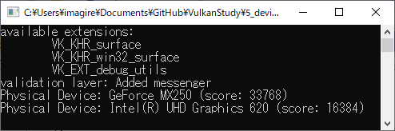
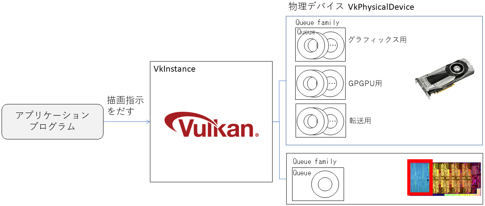

# 物理デバイス

インスタンスを作成しました。これは、アプリケーションから見たVulkan全体のオブジェクトです。
次に描画するハードウェアに対応したオブジェクトの物理デバイスのオブジェクトを作ります。


物理デバイスは、GPUをイメージするのが良いでしょう。
最近では、CPUチップの中にGPUの機能が入っていたり、別にビデオカードを指したりと、一つのPCが複数のGPUを持つことがよくあります
（ハイエンドのゲーマーになると一つのPCに複数のGPUを指したりしますし、eGPUと呼ばれる外部の外部のビデオカードが入ったボックスにUSBで接続することで主にノートPCの性能を上げるシステムも見られます）。


今回のプログラムを入力して、[最終的に作られるコード](https://github.com/vulkanstudy/5_device)はこちら。

## 物理デバイスのオブジェクト

物理デバイスは、``VkPhysicalDevice``としてオブジェクト化されます。
``VkPhysicalDevice``は、``VkInstance``を生成するときに内部で作られるので、開発者が生成する必要はありません。
しかし、複数の物理デバイスが存在するので、その中で適切なものを選ばなくてはなりません
（複数のGPUに指示を出す場合は、複数の物理デバイスを同時に制御します）。

ひとまず、一つだけ物理デバイスを使うことにして、物理デバイスのオブジェクトをアプリケーションに追加してみましょう。

```cpp:src/MyApplication.h 
class MyApplication
{
private:
	constexpr static char APP_NAME[] = "Vulkan Application";

	GLFWwindow* window_;
	VkInstance instance_;
	VkPhysicalDevice physicalDevice_ = VK_NULL_HANDLE;// ★追加
	VkDebugUtilsMessengerEXT debugMessenger_;// デバッグメッセージを伝えるオブジェクト
```

このオブジェクトは、``VkInstance``が生成されたら使うことができるので、Vulkanの初期化でオブジェクトを選択する処理を入れてみましょう。

```cpp:src/MyApplication.h 
	// Vulkanの設定
	void initializeVulkan()
	{
		createInstance(&instance_);
		initializeDebugMessenger(instance_, debugMessenger_);
		physicalDevice_ = pickPhysicalDevice(instance_);// ★追加
	}
```

## 物理デバイスの列挙

それでは、``pickPhysicalDevice``の中身を見ていきましょう。

デバイスを選ぶ方法はいくつか考えられます。
GPU名を取得できるので、その名前からユーザーが選ぶこともできますし、最初に見つかったものを使うという手もあるでしょう。
ここでは、GPUの性能よって得点をつけて、最も良い得点のGPUを使うことにしてみます。

物理デバイスを取ってくるのは``vkEnumeratePhysicalDevices``を使います。
他の同様の関数のように、保存先を与えないで実行すると、物理デバイスの数を取得することができるので、
最初に物理デバイスの数を数えて、もう一度、今度は保存先の配列を与えて呼び出して、実体をまとめて引っ張ってきます。

```cpp:src/MyApplication.h
	/*** デバイスの選択 ***/
	static VkPhysicalDevice pickPhysicalDevice(const VkInstance &instance) 
	{
		// デバイス数の取得
		uint32_t deviceCount = 0;
		vkEnumeratePhysicalDevices(instance, &deviceCount, nullptr);
		if (deviceCount == 0) throw std::runtime_error("failed to find GPUs with Vulkan support!");

		// デバイスの取得
		std::vector<VkPhysicalDevice> devices(deviceCount);
		vkEnumeratePhysicalDevices(instance, &deviceCount, devices.data());

		// 適切なデバイスを選出(最高得点のデバイスを使用する)
		VkPhysicalDevice best_device = VK_NULL_HANDLE;
		int best_score = -1000000000;
		for (const auto& device : devices) {
			int score = rateDeviceSuitability(device);// 得点計算
			if (best_score < score) {
				best_device = device;
				best_score = score;
			}
		}

		// 使える物理デバイスがなければ大問題
		if(best_device == VK_NULL_HANDLE) throw std::runtime_error("failed to find a suitable GPU!");

		return best_device;
	}
```

さて、得点付けですが、物理デバイスから``VkPhysicalDeviceProperties``型の特性と、
``VkPhysicalDeviceProperties``型の機能の利用の有無を取得することができます。
これらの情報を基に、アプリケーションで必要な機能から使える物理デバイスを制限したり、
GPUの性能の高さを評価することができます。

ここでは、「そとつけGPUなら+1000」、「最大テクスチャ解像度を得点にそのまま加える」、
「再分割機能に対応していないと却下(コメントアウトで無効)」という条件で得点付けをしてみました。
この評価は、使用する機能で変わってくるので、実際にアプリケーションを作る際は、リリース前に再確認しましょう。

```cpp:src/MyApplication.h 
	static int rateDeviceSuitability(const VkPhysicalDevice device)
	{
		// デバイスに関する情報を取得
		VkPhysicalDeviceProperties deviceProperties;
		VkPhysicalDeviceProperties deviceFeatures;
		vkGetPhysicalDeviceProperties(device, &deviceProperties);
		vkGetPhysicalDeviceFeatures(device, &deviceFeatures);

		int score = 0;

		// 外付けGPUなら高評価
		if (deviceProperties.deviceType == VK_PHYSICAL_DEVICE_TYPE_DISCRETE_GPU) score += 1000;

		// 最大テクスチャ解像度を性能の評価値に加える
		score += deviceProperties.limits.maxImageDimension2D;

		// テッセレーションシェーダに対応していないと問題外(テッセセレーションを使う場合)
//		if (!deviceFeatures.tessellationShader) return 0;

#ifdef _DEBUG
		// デバイス名の表示
		std::cout << "Physical Device: " << deviceProperties.deviceName
			<< " (score: " << score << ")" << std::endl;
#endif // _DEBUG
		return score;
	}
```

今回のプログラムでは、得点付けの最後に各物理デバイスの得点を表示してみました。
著者の執筆環境では、次のような表示が得られました。
本機は、Lenovo ThinkPad T490で、NVIDIA のGeForce MX 250 GPUと、Intelの内臓GPUの2つのGPUを持っているノートPCです。



# キューファミリーズ

実際に、アプリケーションがGPUに指示を出すのには、キュー（quque：先入れ先出しコンテナ）が使われます。アプリケーション側では、やって欲しい処理をどんどんキューにため、
GPUでは、処理が一息ついたら、キューにたまっているコマンドを実行して、アプリケーションからの要求に答えていきます。

さて、実はキューには種類があります。それぞれの仕事を効率的に処理するため、流せるコマンドの種類が決まっています。

- グラフィックスキュー：普通の描画処理はこちらです
- 計算キュー：描画処理以外の汎用計算(GPGPU)のためのコマンドを転送します
- 転送キュー：テクスチャのコピーや描画結果を移すなどのメモリ間の移動を行います

これらの処理の間は依存性が極めて低いので、並列に実行できます。つまり、いろいろなキューを並行で処理することで、
空いているリソースがなるべく無いようにGPUは仕事を詰め込むのです。

ということで、キューはたくさんあったりなかったりします。
これは、GPUの能力によって決まります。

そして、同じ種類のキューをまとめたものをキューファミリーと呼びます。
例えば、グラフィックススキューのファミリーとか、計算キューのファミリーというグループ分けです。
そして、いろいろなキューファミリーの集合をキューファミリーズと言います。



さて、物理デバイスは適切なキューファミリーを持っていなくてはなりません。
例えば、GPGPUをしたいのであれば、計算キューのファミリーが必要です。
物理デバイスの検証に、この項目も追加してみましょう。

## キューファミリーの検証

スコアの算出のコードにキューファミリーに関する項目を追加してみます。
今回は、グラフィックスキューを検索して、それが見つかれば良しとします。

```cpp:src/MyApplication.h 
#include <optional>

	struct QueueFamilyIndices 
	{
		std::optional<uint32_t> graphicsFamily;

		bool isComplete() {
			return graphicsFamily.has_value();// 今回は、登録されていればok
		}
	};


	static int rateDeviceSuitability(const VkPhysicalDevice device)
	{
		(中略)
		
		// Queue Familyの確認
		QueueFamilyIndices indices = findQueueFamilies(device);
		if (!indices.isComplete()) return 0;

		(中略)
	}
```


```cpp:src/MyApplication.h 

```


* [戻る](./)
