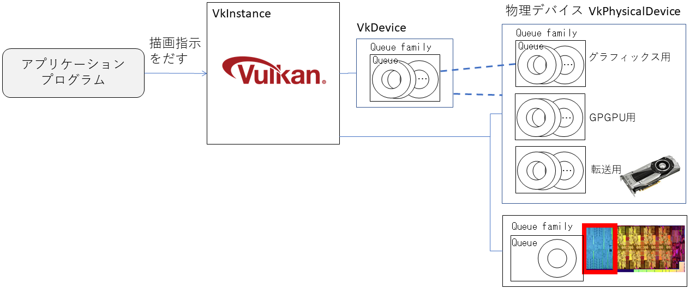
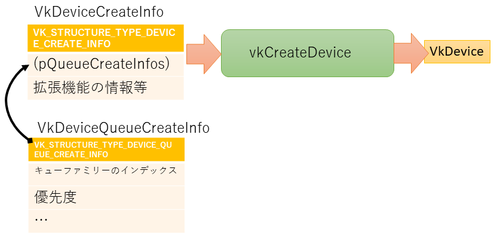

# (論理)デバイス

物理デバイスを取得しました。これで、アプリケーションからGPUの情報がわかります。
しかし、実際に命令をするのは、この物理デバイスへではありません。
命令を出すために物理的なイメージを廃した「論理デバイス」を作成し、こちらに命令を発行することになっていきます。

論理デバイスは、生成する際に物理デバイスやキューファミリーと紐づけます。従って、異なるGPUの物理デバイスとキューファミリーの組み合わせを使うことはできません。



今回のプログラムを入力して、[最終的に作られるコード](https://github.com/vulkanstudy/6_logical_device)はこちら。

## 論理デバイスのオブジェクト

### デバイスの定義

論理デバイスは、``VkDevice``としてオブジェクト化されます。
物理デバイスがインスタンスを作成したときに作られたのとは違って、論理デバイスは自分で作成する必要があります。

```cpp:src/MyApplication.h 
class MyApplication
{
private:
	constexpr static char APP_NAME[] = "Vulkan Application";

	GLFWwindow* window_;
	VkInstance instance_;
	VkPhysicalDevice physicalDevice_ = VK_NULL_HANDLE;
	VkDevice device_;// ★追加
	VkDebugUtilsMessengerEXT debugMessenger_;// デバッグメッセージを伝えるオブジェクト
```

初期化は、物理デバイスを作成した後で行います。

片付けは、``vkDestroyDevice``を呼ぶだけですので、対応する片付けメソッドに追加しましょう。

```cpp:src/MyApplication.h 
	// Vulkanの設定
	void initializeVulkan()
	{
		createInstance(&instance_);
		initializeDebugMessenger(instance_, debugMessenger_);
		physicalDevice_ = pickPhysicalDevice(instance_);
		device_ = createLogicalDevice(physicalDevice_);// ★追加
	}

	void finalizeVulkan()
	{
		vkDestroyDevice(device_, nullptr);// ★追加
		finalizeDebugMessenger(instance_, debugMessenger_);
		vkDestroyInstance(instance_, nullptr);
	}
```

### デバイスの生成

さて、実際に生成する``createLogicalDevice``の中身です。

論理デバイスの初期は、``VkDeviceCreateInfo ``構造体に情報をセットして、``vkCreateDevice``を呼び出します。
構造体の``sType``は、``VK_STRUCTURE_TYPE_DEVICE_CREATE_INFO``です。

``VkDeviceCreateInfo ``構造体には、使用するキューファミリーを設定します。
キューファミリーは、``VkDeviceQueueCreateInfo``構造体に使用する情報を格納します。



コードとしては、長いですが、次のようになります。

```cpp:src/MyApplication.h 
	VkDevice createLogicalDevice(VkPhysicalDevice physicalDevice, VkQueue &graphicsQueue)
	{
		QueueFamilyIndices indices = findQueueFamilies(physicalDevice);

		// 使用するキューに関する情報を記録
		VkDeviceQueueCreateInfo queueCreateInfo = {};
		queueCreateInfo.sType = VK_STRUCTURE_TYPE_DEVICE_QUEUE_CREATE_INFO;
		queueCreateInfo.queueFamilyIndex = indices.graphicsFamily.value();// キューファミリーのインデックス
		queueCreateInfo.queueCount = 1;// キューの個数

		float queuePriority = 1.0f;// キューの優先度を設定
		queueCreateInfo.pQueuePriorities = &queuePriority;

		// デバイスを生成するための情報を構築
		VkDeviceCreateInfo createInfo = {};
		createInfo.sType = VK_STRUCTURE_TYPE_DEVICE_CREATE_INFO;

		createInfo.pQueueCreateInfos = &queueCreateInfo;// VkDeviceQueueCreateInfo
		createInfo.queueCreateInfoCount = 1;

		VkPhysicalDeviceFeatures deviceFeatures = {};// 使用する機能の情報(今回は特に無し)
		createInfo.pEnabledFeatures = &deviceFeatures;

		createInfo.enabledExtensionCount = 0;// 拡張機能(今回は無し)

		// 論理デバイスの作成
		VkDevice device;
		if (vkCreateDevice(physicalDevice, &createInfo, nullptr, &device) != VK_SUCCESS) {
			throw std::runtime_error("failed to create logical device!");
		}
		
		return device;
	}
```

### 検証レイヤーの組み込み

なお、デバイスにも検証レイヤーを挟んでいきます。

ここで、検証レイヤー名の配列は、インスタンス生成とデバイスの生成の両方で使うので、メソッド内の変数から静的メンバーの置き換えました。

```cpp:src/MyApplication.h 
class MyApplication
{
private:
	constexpr static char APP_NAME[] = "Vulkan Application";

	inline static std::vector<const char*> validationLayers = {// ★移動
		"VK_LAYER_KHRONOS_validation"
	};


	VkDevice createLogicalDevice(VkPhysicalDevice physicalDevice, VkQueue &graphicsQueue)
	{
		(中略)
		
		// ★追加：検証レイヤーの設定
		if (enableValidationLayers) {
			createInfo.enabledLayerCount = static_cast<uint32_t>(validationLayers.size());
			createInfo.ppEnabledLayerNames = validationLayers.data();
		}

		// 論理デバイスの作成
		VkDevice device;
		if (vkCreateDevice(physicalDevice, &createInfo, nullptr, &device) != VK_SUCCESS) {
			throw std::runtime_error("failed to create logical device!");
		}

		return device;
	}
```

## デバイスキューの取得

実際に命令を出すキューは、論理デバイスに関連した、``VkQueue``としてオブジェクト化されます。
``VkQueue``は、デバイスが生成した直後に取得してみましょう（インデックス情報のスコープがメソッド内だけのため）。

```cpp:src/MyApplication.h 
class MyApplication
{
private:
	constexpr static char APP_NAME[] = "Vulkan Application";

	inline static std::vector<const char*> validationLayers = {
		"VK_LAYER_KHRONOS_validation"
	};

	GLFWwindow* window_;
	VkInstance instance_;
	VkPhysicalDevice physicalDevice_ = VK_NULL_HANDLE;
	VkDevice device_;
	VkQueue graphicsQueue_; // ★追加
	VkDebugUtilsMessengerEXT debugMessenger_;// デバッグメッセージを伝えるオブジェクト

	VkDevice createLogicalDevice(VkPhysicalDevice physicalDevice, VkQueue &graphicsQueue)// ★引数の修正
	{
		(中略)
		
		// 論理デバイスの作成
		VkDevice device;
		if (vkCreateDevice(physicalDevice, &createInfo, nullptr, &device) != VK_SUCCESS) {
			throw std::runtime_error("failed to create logical device!");
		}

		// ★追加：キューの取得
		vkGetDeviceQueue(device, indices.graphicsFamily.value(), 0, &graphicsQueue);

		return device;
	}
```

このキューをどう使うかは、この後のお楽しみ

* [戻る](./)
