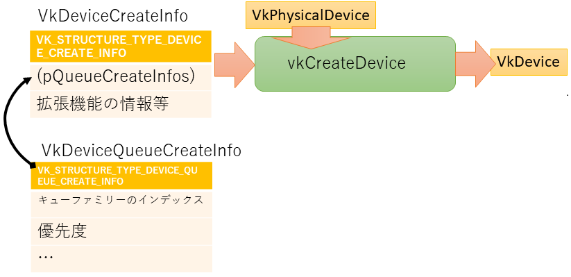

# (論理)デバイス

物理デバイスを取得しました。これで、アプリケーションからGPUの情報がわかります。
しかし、実際に命令をするのは、この物理デバイスへではありません。
命令を出すために物理的なイメージを廃した「論理デバイス」を作成し、こちらに命令を発行することになっていきます。


今回のプログラムを入力して、[最終的に作られるコード](https://github.com/vulkanstudy/6_logical_device)はこちら。

## 論理デバイスのオブジェクト

論理デバイスは、``VkDevice``としてオブジェクト化されます。
物理デバイスがインスタンスを作成したときに作られたのとは違って、論理デバイスは自分で作成する必要があります。

```cpp:src/MyApplication.h 
class MyApplication
{
private:
	constexpr static char APP_NAME[] = "Vulkan Application";

	GLFWwindow* window_;
	VkInstance instance_;
	VkPhysicalDevice physicalDevice_ = VK_NULL_HANDLE;
	VkDevice device_;// ★追加
	VkDebugUtilsMessengerEXT debugMessenger_;// デバッグメッセージを伝えるオブジェクト
```

初期化は、物理デバイスを把握した後で行います。

片付けは、``vkDestroyDevice``を呼ぶだけですので、対応する片付けメソッドに追加しましょう。

```cpp:src/MyApplication.h 
	// Vulkanの設定
	void initializeVulkan()
	{
		createInstance(&instance_);
		initializeDebugMessenger(instance_, debugMessenger_);
		physicalDevice_ = pickPhysicalDevice(instance_);
		device_ = createLogicalDevice(physicalDevice_);// ★追加
	}

	void finalizeVulkan()
	{
		vkDestroyDevice(device_, nullptr);// ★追加
		finalizeDebugMessenger(instance_, debugMessenger_);
		vkDestroyInstance(instance_, nullptr);
	}
```

論理デバイスの初期は、``VkDeviceCreateInfo ``構造体に情報をセットして、``vkCreateDevice``を呼び出します。
構造体の``sType``は、``VK_STRUCTURE_TYPE_DEVICE_CREATE_INFO``です。

``VkDeviceCreateInfo ``構造体には、使用するキューファミリーを設定します。
キューファミリーは、``VkDeviceQueueCreateInfo``構造体に使用する情報を格納します。




```cpp:src/MyApplication.h 
	VkDevice createLogicalDevice(VkPhysicalDevice physicalDevice, VkQueue &graphicsQueue)
	{
		QueueFamilyIndices indices = findQueueFamilies(physicalDevice);

		VkDeviceQueueCreateInfo queueCreateInfo = {};
		queueCreateInfo.sType = VK_STRUCTURE_TYPE_DEVICE_QUEUE_CREATE_INFO;
		queueCreateInfo.queueFamilyIndex = indices.graphicsFamily.value();
		queueCreateInfo.queueCount = 1;

		float queuePriority = 1.0f;
		queueCreateInfo.pQueuePriorities = &queuePriority;

		VkPhysicalDeviceFeatures deviceFeatures = {};

		VkDeviceCreateInfo createInfo = {};
		createInfo.sType = VK_STRUCTURE_TYPE_DEVICE_CREATE_INFO;

		createInfo.pQueueCreateInfos = &queueCreateInfo;
		createInfo.queueCreateInfoCount = 1;

		createInfo.pEnabledFeatures = &deviceFeatures;

		createInfo.enabledExtensionCount = 0;

		// 検証レイヤーの設定
		if (enableValidationLayers) {
			createInfo.enabledLayerCount = static_cast<uint32_t>(validationLayers.size());
			createInfo.ppEnabledLayerNames = validationLayers.data();
		}

		// 論理デバイスの作成
		VkDevice device;
		if (vkCreateDevice(physicalDevice, &createInfo, nullptr, &device) != VK_SUCCESS) {
			throw std::runtime_error("failed to create logical device!");
		}

		// キューの取得
		vkGetDeviceQueue(device, indices.graphicsFamily.value(), 0, &graphicsQueue);

		return device;
	}
```


``VkPhysicalDevice``は、``VkInstance``を生成するときに内部で作られるので、開発者が生成する必要はありません。
しかし、複数の物理デバイスが存在するので、その中で適切なものを選ばなくてはなりません
（複数のGPUに指示を出す場合は、複数の物理デバイスを同時に制御します）。

ひとまず、一つだけ物理デバイスを使うことにして、物理デバイスのオブジェクトをアプリケーションに追加してみましょう。

```cpp:src/MyApplication.h 
class MyApplication
{
private:
	constexpr static char APP_NAME[] = "Vulkan Application";

	GLFWwindow* window_;
	VkInstance instance_;
	VkPhysicalDevice physicalDevice_ = VK_NULL_HANDLE;// ★追加
	VkDebugUtilsMessengerEXT debugMessenger_;// デバッグメッセージを伝えるオブジェクト
```

このオブジェクトは、``VkInstance``が生成されたら使うことができるので、Vulkanの初期化でオブジェクトを選択する処理を入れてみましょう。

```cpp:src/MyApplication.h 
	// Vulkanの設定
	void initializeVulkan()
	{
		createInstance(&instance_);
		initializeDebugMessenger(instance_, debugMessenger_);
		physicalDevice_ = pickPhysicalDevice(instance_);// ★追加
	}
```

## 物理デバイスの列挙

それでは、``pickPhysicalDevice``の中身を見ていきましょう。

デバイスを選ぶ方法はいくつか考えられます。
GPU名を取得できるので、その名前からユーザーが選ぶこともできますし、最初に見つかったものを使うという手もあるでしょう。
ここでは、GPUの性能よって得点をつけて、最も良い得点のGPUを使うことにしてみます。

物理デバイスを取ってくるのは``vkEnumeratePhysicalDevices``を使います。
他の同様の関数のように、保存先を与えないで実行すると、物理デバイスの数を取得することができるので、
最初に物理デバイスの数を数えて、もう一度、今度は保存先の配列を与えて呼び出して、実体をまとめて引っ張ってきます。

```cpp:src/MyApplication.h
	/*** デバイスの選択 ***/
	static VkPhysicalDevice pickPhysicalDevice(const VkInstance &instance) 
	{
		// デバイス数の取得
		uint32_t deviceCount = 0;
		vkEnumeratePhysicalDevices(instance, &deviceCount, nullptr);
		if (deviceCount == 0) throw std::runtime_error("failed to find GPUs with Vulkan support!");

		// デバイスの取得
		std::vector<VkPhysicalDevice> devices(deviceCount);
		vkEnumeratePhysicalDevices(instance, &deviceCount, devices.data());

		// 適切なデバイスを選出(最高得点のデバイスを使用する)
		VkPhysicalDevice best_device = VK_NULL_HANDLE;
		int best_score = 0;// 最低点は0
		for (const auto& device : devices) {
			int score = rateDeviceSuitability(device);// 得点計算
			if (best_score < score) {
				best_device = device;
				best_score = score;
			}
		}

		// 使える物理デバイスがなければ大問題
		if(best_device == VK_NULL_HANDLE) throw std::runtime_error("failed to find a suitable GPU!");

		return best_device;
	}
```

さて、得点付けですが、物理デバイスから``VkPhysicalDeviceProperties``型の特性と、
``VkPhysicalDeviceProperties``型の機能の利用の有無を取得することができます。
これらの情報を基に、アプリケーションで必要な機能から使える物理デバイスを制限したり、
GPUの性能の高さを評価することができます。

ここでは、「外付けGPUなら+1000」、「最大テクスチャ解像度を得点にそのまま加える」、
「再分割機能に対応していないと却下(コメントアウトで無効)」という条件で得点付けをしてみました。
この評価は、使用する機能で変わってくるので、実際にアプリケーションを作る際は、リリース前に再確認しましょう。

```cpp:src/MyApplication.h 
	static int rateDeviceSuitability(const VkPhysicalDevice device)
	{
		// デバイスに関する情報を取得
		VkPhysicalDeviceProperties deviceProperties;
		VkPhysicalDeviceProperties deviceFeatures;
		vkGetPhysicalDeviceProperties(device, &deviceProperties);
		vkGetPhysicalDeviceFeatures(device, &deviceFeatures);

		int score = 0;

		// 外付けGPUなら高評価
		if (deviceProperties.deviceType == VK_PHYSICAL_DEVICE_TYPE_DISCRETE_GPU) score += 1000;

		// 最大テクスチャ解像度を性能の評価値に加える
		score += deviceProperties.limits.maxImageDimension2D;

		// テッセレーションシェーダに対応していないと問題外(テッセセレーションを使う場合)
//		if (!deviceFeatures.tessellationShader) return 0;

#ifdef _DEBUG
		// デバイス名の表示
		std::cout << "Physical Device: " << deviceProperties.deviceName
			<< " (score: " << score << ")" << std::endl;
#endif // _DEBUG
		return score;
	}
```

今回のプログラムでは、得点付けの最後に各物理デバイスの得点を表示してみました。
著者の執筆環境では、次のような表示が得られました。
本機は、Lenovo ThinkPad T490で、NVIDIA のGeForce MX 250 GPUと、Intelの内臓GPUの2つのGPUを持っているノートPCです。


# キューファミリー

実際に、アプリケーションがGPUに指示を出すのには、キュー（quque：先入れ先出しコンテナ）が使われます。アプリケーション側では、やって欲しい処理をどんどんキューにため、
GPUでは、処理が一息ついたら、キューにたまっているコマンドを実行して、アプリケーションからの要求に答えていきます。

さて、実はキューには種類があります。それぞれの仕事を効率的に処理するため、流せるコマンドの種類が決まっています。

- グラフィックスキュー：普通の描画処理はこちらです
- 計算キュー：描画処理以外の汎用計算(GPGPU)のためのコマンドを転送します
- 転送キュー：テクスチャのコピーや描画結果を移すなどのメモリ間の移動を行います

これらの処理の間は依存性が極めて低いので、並列に実行できます。つまり、いろいろなキューを並行で処理することで、
空いているリソースがなるべく無いようにGPUは仕事を詰め込むのです。

ということで、キューはたくさんあったりなかったりします。
これは、GPUの能力によって決まります。

そして、同じ種類のキューをまとめたものをキューファミリーと呼びます。
例えば、グラフィックススキューのファミリーとか、計算キューのファミリーというグループ分けです。


さて、物理デバイスは適切なキューファミリーを持っていなくてはなりません。
例えば、GPGPUをしたいのであれば、計算キューのファミリーが必要です。
物理デバイスの検証に、この項目も追加してみましょう。

## キューファミリーの検証

今回は、グラフィックスキューを検索して、それが見つかれば良しとするものを作りましょう。
スコアの算出のコードにキューファミリーに関する項目を追加してみます。

```cpp:src/MyApplication.h 
	static int rateDeviceSuitability(const VkPhysicalDevice device)
	{
		(中略)
		
		// Queue Familyの確認
		if (findQueueFamilies(device)) return 0;

		(中略)
	}
```

さて、ここでは、キューがあるかどうかを見ましたが、少し後で、複数のキュー(グラフィックスキューと転送キュー)が存在するのか知りたくなります。
とすると、bool 型で返すのは良くなく、それぞれの区別もつけたいので、キューにIDをつけることで、見つかったことに変更します。

```cpp:src/MyApplication.h 
	struct QueueFamilyIndices 
	{
		uint32_t graphicsFamily;
	};


	static int rateDeviceSuitability(const VkPhysicalDevice device)
	{
		(中略)
		
		// Queue Familyの確認
		QueueFamilyIndices indices;
		indices.graphicsFamily = findQueueFamilies(device);
		if (indices.graphicsFamily != 0) return 0;

		(中略)
	}
```


というのは、もっともそうですが、実はこれは適切ではありません。
キューのIDの値が0になる可能性があるため、0をマジックナンバーとして判定するのはよろしくないのです。
ということで、std::optionalを使って、設定されているかどうかでキューの数が正しいかどうかを判定することにします。
具体的には、次のようなコードになります。

```cpp:src/MyApplication.h 
#include <optional>

	struct QueueFamilyIndices 
	{
		std::optional<uint32_t> graphicsFamily;

		bool isComplete() {
			return graphicsFamily.has_value();// 今回は、登録されていればok
		}
	};


	static int rateDeviceSuitability(const VkPhysicalDevice device)
	{
		(中略)
		
		// Queue Familyの確認
		QueueFamilyIndices indices = findQueueFamilies(device);
		if (!indices.isComplete()) return 0;

		(中略)
	}
```

## キューファミリーを調べる

残りの``findQueueFamilies``の中身を作っていきましょう。
キューファミリーを取得するには、``vkGetPhysicalDeviceQueueFamilyProperties``を呼びます。
他と同じように、書き込み先を``nullptr``にして、呼び出すことで個数が得られます。

```cpp:src/MyApplication.h 
	static QueueFamilyIndices findQueueFamilies(VkPhysicalDevice device) 
	{
		// キューファミリーの数を取得
		uint32_t queueFamilyCount = 0;
		vkGetPhysicalDeviceQueueFamilyProperties(device, &queueFamilyCount, nullptr);
		// キューファミリーを取得
		std::vector<VkQueueFamilyProperties> queueFamilies(queueFamilyCount);
		vkGetPhysicalDeviceQueueFamilyProperties(device, &queueFamilyCount, queueFamilies.data());
		
		...
	}
```

得られた``VkQueueFamilyProperties``には、サポートする種類や、作成できるキューの数などの情報が含まれています。
使用できるキューの種類は、queueFamily.queueFlagsの中に論理和の形で記録されています。

- VK_QUEUE_GRAPHICS_BIT = 0x00000001 : グラフィックスキューに使える
- VK_QUEUE_COMPUTE_BIT = 0x00000002  : 計算キューに使える
- VK_QUEUE_TRANSFER_BIT = 0x00000004 : 転送キューに使える
- VK_QUEUE_SPARSE_BINDING_BIT = 0x00000008 : 仮想メモリ機能に対応 
- VK_QUEUE_PROTECTED_BIT = 0x00000010 : 保護メモリ機能に対応

今回は、グラフィックスキューが欲しいので、``VK_QUEUE_GRAPHICS_BIT``と論理積を取って0でないキューであれば、めでたしです。
見つかったキューファミリーのインデックスを返り値に設定ます。

のちのちのためなのですが、インデックスを設定した後に返り値がすべて設定されたら確認をやめて帰るようにします。

```cpp:src/MyApplication.h 
	static QueueFamilyIndices findQueueFamilies(VkPhysicalDevice device) 
	{
		(中略)

		int i = 0;
		QueueFamilyIndices indices;
		for (const auto& queueFamily : queueFamilies) {
			// キューファミリーにキューがあり、グラフィックスキューとして使えるか調べる
			if (queueFamily.queueCount > 0 && queueFamily.queueFlags & VK_QUEUE_GRAPHICS_BIT) {
				indices.graphicsFamily = i;
			}

			
			if (indices.isComplete()) {
				break;
			}

			i++;
		}

		return indices;
	}
```

さて、実際のキューの数やキューファミリーはどうなっているのでしょうか？
表示ルーチンを追加してみましょう。

```cpp:src/MyApplication.h 
	static QueueFamilyIndices findQueueFamilies(VkPhysicalDevice device) 
	{
		// キューファミリーの数を取得
		uint32_t queueFamilyCount = 0;
		vkGetPhysicalDeviceQueueFamilyProperties(device, &queueFamilyCount, nullptr);
		// キューファミリーを取得
		std::vector<VkQueueFamilyProperties> queueFamilies(queueFamilyCount);
		vkGetPhysicalDeviceQueueFamilyProperties(device, &queueFamilyCount, queueFamilies.data());

#ifdef _DEBUG
		std::cout << std::endl;// ★追加
#endif // _DEBUG

		int i = 0;
		QueueFamilyIndices indices;
		for (const auto& queueFamily : queueFamilies) {

#ifdef _DEBUG
			std::cout << "queueFamily: " << queueFamily.queueCount << "quque(s)"<< std::endl;// ★追加
#endif // _DEBUG

			// キューファミリーにキューがあり、グラフィックスキューとして使えるか調べる
			if (queueFamily.queueCount > 0 && queueFamily.queueFlags & VK_QUEUE_GRAPHICS_BIT) {
				indices.graphicsFamily = i;
			}

			if (indices.isComplete()) {
				break;
			}

			i++;
		}

		return indices;
	}

```

このプログラムを実行すると、次のような結果が得られました。共にキューファミリーはグラフィックス・計算・転送に対応しているようですが一つしかありません。
キューの数自体は、GeForce MX250 が16個、UHD Graphics 620 は1つしかないようです。


* [戻る](./)
