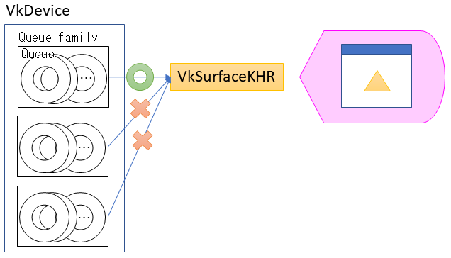

# ウィンドウサーフェス

デバイスを確保できたので、GPUに命令を送る準備が進んできました。
次に考えるのは、ディスプレイへの表示になります。

# サーフェス

ディスプレイへの表示はOSが行います。
具体的には、「画面のどの場所にウィンドウを表示するのか？」、「全画面なのか？」、
「ウィンドウが後ろに隠れているので、今は画面に書き込まなくても良いんじゃない？」
等を気にしながら、描画結果を画面の一部に描き込む処理を管理します。

Vulkanでは、OSに表示して欲しい画像をサーフェスというオブジェクトで管理します。
OSとの画面表示のやり取りはサーフェスを通して行い、描画が終わった画面を表示するように指示していきます。

今回のプログラムを入力して、[最終的に作られるコード](https://github.com/vulkanstudy/7_surface)はこちら。

## サーフェスのオブジェクト

### サーフェスの定義

サーフェスは、``VkSurfaceKHR``をハンドルとしてオブジェクト化されます。

```cpp:src/MyApplication.h 
class MyApplication
{
private:
  (中略)

  GLFWwindow* window_ = nullptr;
	VkInstance instance_;
	VkSurfaceKHR surface_;// ★追加

	VkPhysicalDevice physicalDevice_ = VK_NULL_HANDLE;
	VkDevice device_;
```

初期化は、物理デバイスを作成する前に行います。デバイスを生成する際に、サーフェスに対応しているのか調べながら選択することになるので、
インスタンスを作成した直後に初期化していきます。

片付けは、``vkDestroySurfaceKHR``を呼ぶだけでになります。対応する片付けメソッドに追加しましょう。

```cpp:src/MyApplication.h 
	// Vulkanの設定
	void initializeVulkan()
	{
		createInstance(&instance_);
		initializeDebugMessenger(instance_, debugMessenger_);
		surface_ = createSurface(instance_, window_);// ★追加
		physicalDevice_ = pickPhysicalDevice(instance_, surface_);// ★修正
		device_ = createLogicalDevice(physicalDevice_, graphicsQueue_, surface_);// ★修正
	}

	void finalizeVulkan()
	{
		vkDestroyDevice(device_, nullptr);
		finalizeDebugMessenger(instance_, debugMessenger_);
		vkDestroySurfaceKHR(instance_, surface_, nullptr);// ★追加
		vkDestroyInstance(instance_, nullptr);
	}
```

### サーフェスの生成

さて、実際に生成する``createSurface``の中身です。

サーフェスはOSに密接にかかわるので、Windowsでは、アプリケーションインスタンスやウインドウハンドルといったような、
ウィンドウに関する情報が必要になってきます。

具体的には、``VkWin32SurfaceCreateInfoKHR``構造体というのが定義されているので、こちらにWindows特有の情報を設定して、
``vkCreateWin32SurfaceKHR``関数を呼び出します。

```cpp:src/MyApplication.h 
	static VkSurfaceKHR createSurface(VkInstance instance, GLFWwindow* window)
	{
		VkSurfaceKHR surface;

		VkWin32SurfaceCreateInfoKHR createInfo = {};
		createInfo.sType = VK_STRUCTURE_TYPE_WIN32_SURFACE_CREATE_INFO_KHR;
		createInfo.hwnd = glfwGetWin32Window(window);
		createInfo.hinstance = GetModuleHandle(nullptr);

		if (vkCreateWin32SurfaceKHR(instance, &createInfo, nullptr, &surface) != VK_SUCCESS) {
			throw std::runtime_error("failed to create window surface!");
		}

		return surface;
	}
```

が、GLFWでは、OSの情報をGLFWwindowオブジェクトに隠ぺいして機種を問わず呼び出せるような仕組みが整っています。
ということで、実用上は、``glfwCreateWindowSurface``を呼び出すだけでサーフェスを作ることができます。

```cpp:src/MyApplication.h 
	static VkSurfaceKHR createSurface(VkInstance instance, GLFWwindow* window)
	{
		VkSurfaceKHR surface;
		if (glfwCreateWindowSurface(instance, window, nullptr, &surface) != VK_SUCCESS) {
			throw std::runtime_error("failed to create window surface!");
		}

		return surface;
	}
```

# プレゼントキュー

さて、画面に対するアクセスができたので、こちらに描画すればよいのですが、制限があるようです。
GPUに命令を伝えるqueueは、たとえグラフィックス用のqueueだとしても、サーフェスにアクセスできない場合があるようなのです。
グラフィックスの描画は、2次元の画像として絵を生成することが多いですが、この書き込み先にサーフェスを直接には書けない（命令を出せない）場合があるようなのです。



## プレゼントキューの定義

ということで、サーフェスに対して指示を行うキューを選別する必要があります。
今回は、``presentQueue``として、描画命令用のキューとは別にキューを用意しましょう。

```cpp:src/MyApplication.h 
class MyApplication
{
private:
	(中略)

	VkQueue graphicsQueue_;
	VkQueue presentQueue_;// ★追加
```

複数のqueueを扱うことになるので、今までのプログラムを拡張していきます。

## プレゼントキューの取得

queueのインデックスを格納する``QueueFamilyIndices``を複数のキューに拡張します。
こちら、``presentQueue``を保持するキューファミリーも保持できるようにします
（この``presentFamily``は``graphicsFamily``と同じものかもしれません）。

```cpp:src/MyApplication.h 
	struct QueueFamilyIndices
	{
		std::optional<uint32_t> graphicsFamily;
		std::optional<uint32_t> presentFamily;// ★追加：OSの描画システムに結果を送るためのキューファミリー

		bool isComplete() {
			return graphicsFamily.has_value()
				&& presentFamily.has_value();// ★修正
		}
	};
```

キューファミリーは物理デバイスに対して含まれているかどうか確認します。
デバイスが持つキューファミリーについて、その中にサーフェスに送れるキューを持っているかどうかは、
``vkGetPhysicalDeviceSurfaceSupportKHR`` を呼び出すことで変わります。
キューを実際に持っていて、その中に対象とするサーフェスに命令を送れるものがあるキューファミリーを登録します。

```cpp:src/MyApplication.h 
	static QueueFamilyIndices findQueueFamilies(VkPhysicalDevice device, const VkSurfaceKHR surface)
	{
		(中略)

		int i = 0;
		QueueFamilyIndices indices;
		for (const auto& queueFamily : queueFamilies) 
		{
			// キューファミリーにキューがあり、グラフィックスキューとして使えるか調べる
			if (queueFamily.queueCount > 0 && queueFamily.queueFlags & VK_QUEUE_GRAPHICS_BIT) {
				indices.graphicsFamily = i;
			}

			// ★追加：プレゼントキュー
			VkBool32 presentSupport = false;
			vkGetPhysicalDeviceSurfaceSupportKHR(device, i, surface, &presentSupport);// サーフェスに送れる?
			if (queueFamily.queueCount > 0 && presentSupport) {
				indices.presentFamily = i;
			}

			if (indices.isComplete()) {
				break;
			}

			i++;
		}

		return indices;
	}
```


少しずつ画面への表示に近づいてきました。

* [戻る](./)
